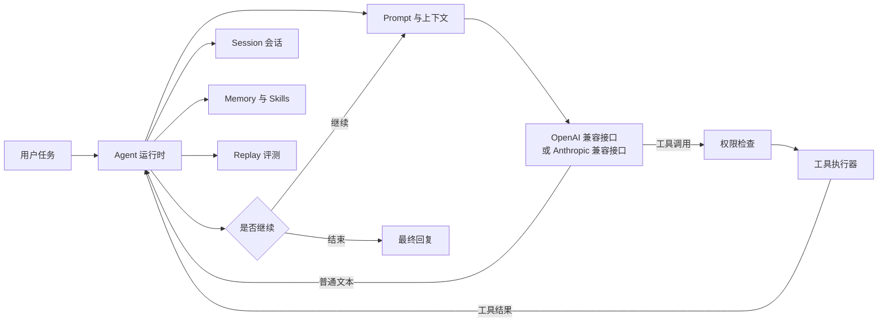

# Aegis

> 面向长程代码任务的可评测、自进化 Agent 运行时。

Aegis 是一个使用 Python 编写的本地 Coding Agent。它把大模型接入本地
工作区，但不会让模型直接读写文件或执行 Shell。模型只负责理解任务、
规划下一步动作并提出工具调用，真正的权限判断、环境操作、结果回写和
会话保存都由运行时统一负责。

这个项目适合用来学习 Coding Agent 的底层实现，也适合作为个人代码助手、
项目分析助手和长程任务实验平台。项目没有把关键逻辑全部藏在大型框架
中，而是把 Agent Loop、工具调用、权限控制、会话状态、上下文压缩、长期
记忆、Skills、MCP、子 Agent 和离线评测都放在比较容易阅读的位置。

## 项目要解决什么问题

很多 Agent 示例只展示“一次模型请求 + 一次工具调用”。这种方式适合演示，
但真实的代码任务往往要持续运行很多轮：

- 一个任务可能要经历几十轮模型推理和工具执行；
- 工具可能执行失败、返回过多内容，或者因为文件被修改而变得过时；
- 对话变长以后，不能简单地把历史消息全部塞给模型；
- 上一次任务中得到的经验，需要和当前任务的临时事实区分开；
- 新生成的 Skill 不能因为“成功生成”就直接覆盖当前可用版本。

Aegis 试图把这些问题串成一条完整链路：

```text
模型推理
  -> 工具调用
  -> 权限检查
  -> 环境执行
  -> 结果回写
  -> 上下文管理
  -> 会话记忆折叠
  -> Skills 沉淀
  -> Replay 评测
  -> 质量反馈
  -> 持续改进
```

## 核心设计

模型负责“想下一步做什么”，运行时负责“这一步能不能做、怎么做、做完
后发生什么”。



例如用户提出：

```text
比较 agent.py 和 tools.py 的实现，并指出工具调用的入口。
```

模型并不能直接打开文件，实际过程大致如下：

```text
第 1 步：用户消息
  {"role": "user", "content": "比较 agent.py 和 tools.py"}

第 2 步：模型返回工具调用意图
  read_file(path="agent.py")
  read_file(path="tools.py")

第 3 步：运行时处理
  - 校验工具名称和参数
  - 根据当前权限模式判断是否允许
  - 执行文件读取
  - 记录成功结果或错误信息

第 4 步：结果回写
  两个工具结果以 tool 消息加入会话历史，再发送给模型。

第 5 步：模型继续推理
  如果信息已经足够，模型输出比较结果；如果还缺少内容，继续请求工具。
```

这种分工有两个好处：一是文件和 Shell 操作可以被统一审计，二是工具失败
不会被宿主进程静默吞掉，模型能够看到错误并决定重试、换方案或结束任务。

## 主要功能

### 1. Agent 运行时

- 完整的 Agent Loop：用户输入、模型调用、工具调用、结果回写和最终回复。
- 支持 OpenAI 兼容接口和 Anthropic 兼容接口，并在上层共享同一套运行时。
- 支持一次模型回复包含多个相互独立的工具调用。
- 支持最大迭代轮数、费用上限、中断检查和会话持久化。
- 对非法工具参数、模型异常和工具执行异常进行统一处理。

### 2. 工具系统与权限控制

当前工具层包含文件读取、目录列表、代码搜索、文件编辑、Shell 执行、
Skill 调用、子 Agent 调度和 MCP 工具。

- 普通模式下，写文件和危险操作需要经过权限判断；
- Plan Mode 只允许分析和规划，阻止写文件与 Shell 修改操作；
- 只读工具在相互独立时可以批量调度，写操作和状态改变操作会形成顺序屏障；
- 编辑已有文件前要求先读取文件，并通过修改时间校验降低覆盖并发修改的风险；
- 工具失败也会生成结果消息，交给模型决定如何恢复。

这里的关键不是工具数量，而是所有工具都经过同一条“参数校验 -> 权限判断
-> 执行 -> 结果回写”链路。

### 3. 长程会话与上下文压缩

长程任务中，原始消息、工具结果、失败尝试和中间信息会不断增长。Aegis
把会话当作运行时状态管理，而不是一段永远追加的字符串。

- 支持自动保存和恢复 Session；
- 超大的工具结果可以截断，也可以单独持久化；
- 支持手动折叠、阈值触发的自动折叠和模型主动请求折叠；
- 折叠结果使用稳定的结构化记忆，而不是只有一段无法校验的摘要；
- 模型返回非法 JSON、字段缺失或字段类型错误时，会执行规范化和兜底；
- 记录折叠前后的消息数量、字符数量、耗时和 fallback 情况。

结构化折叠记忆分成三层：

```text
episode_memory      # 当前任务的整体经历
  - task_description
  - key_events
  - current_progress

working_memory      # 当前正在处理的局部目标
  - immediate_goal
  - current_challenges
  - next_actions

tool_memory         # 工具使用经验
  - tools_used
  - derived_rules
```

这样做的目的不是单纯让上下文变短，而是在压缩之后仍然能够回答：任务
目标是什么、已经完成了什么、当前卡在哪里、接下来应该做什么，以及之前
哪些工具调用有效或失败过。

### 4. Memory 与 Skills

Memory 和 Skills 保存的是两类不同的信息：

| 机制 | 保存内容 | 示例 |
| --- | --- | --- |
| Memory | 项目事实、用户偏好、历史决策和参考资料 | “这个服务使用 PostgreSQL，测试命令是 pytest。” |
| Skill | 可以反复使用的方法、规范和工作流 | “修改接口时先更新 schema，再补回归测试，最后运行契约检查。” |

Skills 可以被发现、检索并注入 Prompt，也可以以内联或隔离分支的方式执行。
用户明确给出的稳定反馈会进入 pending window，随后由抽取器生成候选 Skill，
再由维护器判断应该：

```text
add       新增一个 Skill
merge     合并到相似的已有 Skill
discard   丢弃证据不足或不可复用的候选
```

每次演化都可以记录来源、使用次数、版本快照和效果。目标不是让系统不断
产生更多 Skill，而是让有效经验能够留下，并且能够解释它为什么被留下。

### 5. Skills Replay 评测

自进化功能必须有质量门槛。Aegis 提供不依赖真实模型的离线 Replay 流程，
可以对固定样本重复运行：

```text
用户反馈
  -> 构造 Replay 样本
  -> 编译评测规则
  -> 程序规则检查
  -> 可选的 LLM Judge
  -> 生成 Candidate
  -> 对 Candidate 重新 Replay
  -> 与当前版本对比
  -> 满足门槛后记录 Champion
```

评测报告同时输出 JSON 和 Markdown，包含规则通过率、硬失败、样本级失败
原因，并区分程序规则和模型判断。Candidate 不会因为“生成成功”就直接
覆盖 active Skill，只有满足质量门槛才可能成为 Champion。

### 6. MCP 与子 Agent

- MCP Server 通过 stdio JSON-RPC 暴露外部工具；
- Aegis 将外部工具包装成类似 `mcp__server_name__tool_name` 的名称；
- 子 Agent 使用隔离上下文处理探索、规划或局部任务，再把结果返回给父 Agent；
- 外部能力通过 MCP 接入，不需要把每一种业务系统硬编码进核心运行时。

## 项目结构

```text
Aegis/
├── agents/
│   ├── main.py                    # CLI 入口、参数解析和 REPL
│   ├── agent.py                   # Agent Loop、模型调用、工具调度和压缩
│   ├── prompt.py                  # System Prompt 构建
│   ├── tools.py                   # 内置工具和权限检查
│   ├── session.py                 # Session 保存与恢复
│   ├── session_memory.py          # 折叠记忆结构和校验
│   ├── memory.py                  # 按项目隔离的长期记忆
│   ├── skills.py                  # Skill 加载、检索和执行
│   ├── skill_evolution.py         # Skill 文件、快照和使用统计
│   ├── online_skill_evolution.py  # 基于反馈的 add/merge/discard 流程
│   ├── online_skill_eval.py       # Replay 规则和评测报告
│   ├── mcp_client.py              # stdio JSON-RPC MCP Client
│   ├── subagent.py                # 子 Agent 定义和调度
│   └── context_experiment.py      # 上下文策略对比实验
├── experiments/                   # 小型、可重复的实验输入
├── tests/                         # 不依赖真实模型的回归测试
├── scripts/                       # 离线评测入口
├── wiki/                          # 架构和源码阅读文档
├── .bear/                         # 项目级 Skill 和本地运行状态
├── Dockerfile
├── requirements.txt
├── requirements-dev.txt
└── README.md
```

大型 benchmark 数据集和论文文件不属于运行时必需内容，因此没有放入公开
源码版本。项目自带的小型实验输入和测试可以直接运行。

## 快速开始

### 环境要求

- Python 3.11 或更高版本；
- Git；
- 一个 OpenAI 兼容或 Anthropic 兼容的模型接口；
- 推荐安装 `ripgrep`，用于代码搜索工具。

### Linux 和 macOS

```bash
python3 -m venv .venv
source .venv/bin/activate
python -m pip install -r requirements-dev.txt
cp .env.example .env
python -m agents.main --help
```

### Windows PowerShell

```powershell
py -3.11 -m venv .venv
& .\.venv\Scripts\Activate.ps1
python -m pip install -r requirements-dev.txt
Copy-Item .env.example .env
python -m agents.main --help
```

打开 `.env`，填写一种模型接口配置。`.env` 已被 Git 忽略，真实 API Key
不要提交到仓库。

```dotenv
# 通用兼容接口
APIKEY=sk-your-api-key
API=https://your-provider.example/v1
MODEL=your-model-name

# 或者使用 OpenAI 兼容配置
# OPENAI_API_KEY=sk-your-api-key
# OPENAI_BASE_URL=https://your-provider.example/v1
# MODEL=your-model-name

# 或者使用 Anthropic 兼容配置
# ANTHROPIC_API_KEY=sk-ant-your-api-key
# ANTHROPIC_BASE_URL=https://api.anthropic.com
# MODEL=claude-sonnet-4-6
```

启动交互式会话：

```bash
python -m agents.main
```

执行一次任务后退出：

```bash
python -m agents.main "梳理这个项目的 Agent Loop，并指出工具调用的入口"
```

常用模式：

```bash
python -m agents.main --plan "分析如何重构 Skills 检索逻辑"
python -m agents.main --accept-edits
python -m agents.main --resume
```

`--plan` 用于只读分析和规划；`--accept-edits` 允许正常编辑文件，但仍然
会经过运行时权限判断；`--yolo` 会跳过确认，建议只在明确知道风险时使用。

## 测试与离线实验

测试不调用真实模型，而是使用 Fake Model、临时目录和固定输入，检查协议、
权限、持久化、异常处理和评测逻辑。

运行全部测试：

```bash
python -m pytest tests -q
```

运行上下文策略实验：

```bash
python -m agents.context_experiment \
  --input experiments/context_strategy_input.json \
  --output-dir artifacts/context-experiment
```

运行离线 Skills Replay：

```bash
python scripts/run_skill_replay.py \
  --input experiments/skill_replay_input.json \
  --output-dir artifacts/skill-replay
```

两个实验都会输出 JSON 和 Markdown 报告。当前上下文实验主要统计消息大小
和关键事实保留情况，不会把“上下文更短”直接等同于“任务完成率更高”。
如果要研究长程任务完成率，需要设计固定任务集并记录真实运行数据。

## 推荐的源码阅读顺序

如果你想从头学习 Coding Agent，可以按下面的顺序阅读：

1. `agents/main.py`：CLI 参数、启动过程和 REPL；
2. `agents/agent.py`：`Agent.chat()`、模型调用路径和主循环；
3. `agents/tools.py`：工具 Schema、权限判断、路由和结果格式；
4. `agents/session.py`：哪些状态会保存，以及如何恢复会话；
5. `agents/session_memory.py`：上下文折叠使用的结构和校验；
6. `agents/memory.py`、`agents/skills.py`：事实记忆和可复用方法的区别；
7. `agents/online_skill_evolution.py`、`agents/skill_evolution.py`：反馈如何变成 Skill；
8. `agents/online_skill_eval.py`：为什么 Candidate 必须经过 Replay；
9. `agents/mcp_client.py`、`agents/subagent.py`：外部扩展和上下文隔离。

阅读每个模块时，建议先写下它的输入和输出，再看具体实现。可以重点问：

- 这一轮会向消息列表追加什么对象？
- 谁负责做权限决定？
- 工具失败后，错误如何传回模型？
- 哪些状态能够跨进程重启保留？
- 哪些信息可以压缩，哪些信息不能丢？
- Skill 被修改前需要什么证据？

`wiki/` 目录提供了更长的架构说明、源码阅读笔记和流程图。

## 配置与运行时数据

凭据和项目状态分开保存。常用路径如下：

| 数据 | 默认位置 |
| --- | --- |
| 项目级 Skills | `<project>/.bear/skills/` |
| Skills 演化审计 | `<project>/.bear/skill-evolution/` |
| 用户级 Skills | `~/.bear/skills/` |
| 长期 Memory | `~/.BearCode/projects/<project_hash>/memory/` |
| Session 会话 | `~/.bear-code/sessions/` |
| 大型工具结果 | `~/.bear-code/tool-results/` |
| Plan 文件 | `~/.bear/plans/` |

`.bear/` 下的会话、用户 Skill 和演化产物属于本地运行状态。提交前请检查
`.gitignore`，避免把凭据、私人数据和生成文件加入 Git。

## Docker 运行

构建镜像：

```bash
docker build -t aegis-agent .
```

挂载当前项目并启动：

```bash
docker run --rm -it \
  --env-file .env \
  -v "$PWD:/workspace" \
  -v aegis-sessions:/root/.bear-code \
  -v aegis-memory:/root/.BearCode \
  aegis-agent
```

容器可以把 Session 和 Memory 放在源码目录之外。文件和 Shell 工具仍然会
作用于挂载的 `/workspace`，请根据任务选择合适的权限模式。

## 如何参与

小而明确的修改最容易被检查和合并。一个完整的改动通常应该包含：

1. 简短说明要改变的行为；
2. 覆盖正常路径和失败路径的无模型回归测试；
3. 对消息格式、权限或持久化不变量的说明；
4. 用户可见行为变化对应的文档更新。

请不要提交真实凭据、私人项目数据、生成的 Session 文件或没有明确授权的
大型 benchmark 数据。如果改动了 Agent Loop，最好从模型响应一直测到工具
结果回写，而不是只测试某一个孤立辅助函数。

## 当前边界

Aegis 目前定位为学习和实验项目，重点是把长时间运行的 Coding Agent 中
比较难理解的部分变得可读、可运行、可测试。它不是一个已经部署好的多用户
服务。模型接口的具体行为取决于所配置服务的兼容程度，真实模型调用适合
作为人工冒烟测试；离线测试和 Replay 报告是更稳定的验证基础。

## 许可证

当前仓库还没有添加许可证。在明确添加许可证之前，仓库可以用于阅读和学习，
但代码的复用和再分发应先获得作者许可。
