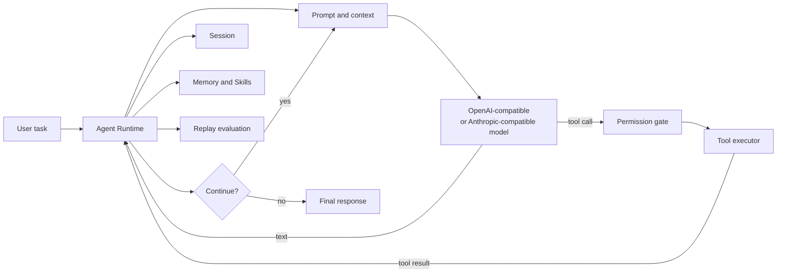

# Aegis

> A readable long-horizon agent runtime for coding tasks.

Aegis is a Python-based coding agent runtime. It connects a language model to a
local workspace, but keeps the model away from direct filesystem and shell
access. The model proposes an action; the runtime checks the action, executes it
in the environment, sends the result back, and decides whether another model
round is needed.

The project is intentionally built to be read. Instead of hiding everything
behind a large framework, Aegis keeps the important parts of an agent in one
place: the agent loop, tool calling, permission checks, session state, context
compression, memory, skills, MCP, sub-agents, and offline evaluation.

## Why this project exists

Many agent examples demonstrate one model request followed by one tool call.
That is enough for a demo, but a coding agent has to deal with a much longer
chain of events:

- the task may take dozens of model/tool rounds;
- a tool may fail, return too much data, or become stale after a file changes;
- the context eventually needs to be compressed without losing the goal;
- useful lessons should be separated from one-off conversation facts;
- a newly generated skill should be evaluated before it replaces a working one.

Aegis is a small environment for exploring these problems end to end. It is
useful as a personal coding agent, as a source-reading project, and as a base
for experiments on long-horizon task continuity.

## The main idea

The model is responsible for reasoning and selecting the next action. The
runtime is responsible for state, safety, execution, and recovery.



For example, when the user asks “compare `agent.py` and `tools.py`”, the model
does not open those files by itself:

```text
1. User message
   "Compare agent.py and tools.py"

2. Model response
   tool_call: read_file(path="agent.py")
   tool_call: read_file(path="tools.py")

3. Runtime
   - validates the arguments
   - checks the permission mode
   - executes the file reads
   - records the result and any error

4. Next model request
   The two tool results are included in the conversation.

5. Model response
   It either produces the comparison or asks for another tool call.
```

This separation makes the system easier to audit and makes failures visible to
the model instead of silently hiding them in the host process.

## What is implemented

### Agent Runtime

- A complete agent loop from user input to final response.
- OpenAI-compatible and Anthropic-compatible provider paths behind one runtime.
- Text responses and multiple tool calls in the same model response.
- Tool result recording, iteration limits, cost limits, interruption checks,
  and session persistence.

### Tools and safety

- File reading, directory listing, code search, file editing, shell execution,
  skill execution, sub-agent dispatch, and MCP tools.
- Permission modes for normal execution, plan-only work, accepted edits, and
  fully automatic execution.
- Read-only tool calls can be grouped when they are independent; write and
  state-changing operations act as ordering barriers.
- File edits use read-before-edit and modification-time checks to reduce the
  chance of overwriting changes made by another process.
- Tool failures are returned as structured results so that the model can
  repair the request, choose another route, or stop with an explanation.

### Long-running sessions

Aegis treats the conversation as mutable runtime state rather than a string
that is sent to the model forever.

- Sessions can be saved and resumed.
- Oversized tool results can be truncated or persisted separately.
- Context can be compacted manually, automatically, or by a model-requested
  compaction action.
- Structured folded memory keeps three different kinds of information apart:

```text
episode_memory
  - task_description
  - key_events
  - current_progress

working_memory
  - immediate_goal
  - current_challenges
  - next_actions

tool_memory
  - tools_used
  - derived_rules
```

The compaction path validates the model-produced structure, repairs missing
fields, falls back safely when the model returns invalid JSON, and records
before/after statistics. This makes it possible to measure context folding
instead of judging it only by how short the prompt became.

### Memory and Skills

Memory and Skills solve different problems:

| Mechanism | Stores | Example |
| --- | --- | --- |
| Memory | Project facts, preferences, decisions, and references | “This service uses PostgreSQL and the tests run with pytest.” |
| Skill | A reusable method or workflow | “For API changes, update the schema, add a regression test, and run the contract checks.” |

Skills can be discovered and injected into a prompt, executed inline or in an
isolated fork, and tracked by usage statistics. Explicit user feedback can
open a pending extraction window. The evolution pipeline then makes an
add/merge/discard decision instead of turning every sentence into a new file.

Each change can keep provenance, usage information, and version snapshots. The
goal is not “the agent writes more Skills”; the goal is “the agent keeps useful
Skills and can explain where they came from.”

### Replay evaluation

Online self-improvement needs a gate. Aegis includes a model-free Replay path
that can be run repeatedly against fixed samples:

```text
feedback
  -> replay sample
  -> compiled rules
  -> programmatic checks
  -> optional LLM judgments
  -> candidate skill
  -> candidate replay
  -> comparison with the active version
  -> champion record when quality gates pass
```

The current implementation writes both JSON and Markdown reports. It records
rule pass rate, hard failures, sample-level reasons, and the distinction between
program rules and model judgments. A candidate is not allowed to replace the
active Skill merely because it was generated successfully.

### MCP and sub-agents

- MCP servers communicate over stdio JSON-RPC.
- External tools are exposed through names such as
  `mcp__server_name__tool_name`.
- Sub-agents receive isolated context for exploration, planning, or a bounded
  local task, then return a result to the parent agent.

## Repository layout

```text
Aegis/
├── agents/
│   ├── main.py                    # CLI entry point and REPL
│   ├── agent.py                   # Agent loop, providers, tools, compaction
│   ├── prompt.py                  # System prompt construction
│   ├── tools.py                   # Built-in tools and permission checks
│   ├── session.py                 # Session persistence and restoration
│   ├── session_memory.py          # Folded-memory schema and validation
│   ├── memory.py                  # Project-scoped long-term memory
│   ├── skills.py                  # Skill loading, search, and execution
│   ├── skill_evolution.py         # Skill files, snapshots, and statistics
│   ├── online_skill_evolution.py  # Feedback-driven add/merge/discard flow
│   ├── online_skill_eval.py       # Replay rules and reports
│   ├── mcp_client.py              # stdio JSON-RPC MCP client
│   ├── subagent.py                # Sub-agent definitions and dispatch
│   └── context_experiment.py      # Context-strategy comparison experiments
├── experiments/                   # Small, reproducible experiment inputs
├── tests/                         # Model-free regression tests
├── scripts/                       # Offline evaluation entry points
├── wiki/                          # Architecture and source-reading notes
├── .bear/                         # Project Skills and local agent state
├── Dockerfile
├── requirements.txt
├── requirements-dev.txt
└── README.md
```

Large benchmark datasets and paper files are kept out of the source checkout
used for the public example. They are not required to run the agent or the
model-free tests.

## Quick start

### Requirements

- Python 3.11 or newer
- Git
- An OpenAI-compatible or Anthropic-compatible model endpoint for live runs
- `ripgrep` is recommended for the code-search tool

### Linux and macOS

```bash
python3 -m venv .venv
source .venv/bin/activate
python -m pip install -r requirements-dev.txt
cp .env.example .env
python -m agents.main --help
```

### Windows PowerShell

```powershell
py -3.11 -m venv .venv
& .\.venv\Scripts\Activate.ps1
python -m pip install -r requirements-dev.txt
Copy-Item .env.example .env
python -m agents.main --help
```

Open `.env` and fill in one provider configuration. The file is ignored by
Git; never commit a real API key.

```dotenv
# Generic compatible endpoint
APIKEY=sk-your-api-key
API=https://your-provider.example/v1
MODEL=your-model-name

# Or OpenAI-compatible configuration
# OPENAI_API_KEY=sk-your-api-key
# OPENAI_BASE_URL=https://your-provider.example/v1
# MODEL=your-model-name

# Or Anthropic-compatible configuration
# ANTHROPIC_API_KEY=sk-ant-your-api-key
# ANTHROPIC_BASE_URL=https://api.anthropic.com
# MODEL=claude-sonnet-4-6
```

Start an interactive session:

```bash
python -m agents.main
```

Run one task and exit:

```bash
python -m agents.main "梳理这个项目的 Agent Loop，并指出工具调用的入口"
```

Useful modes:

```bash
python -m agents.main --plan "分析如何重构 Skills 检索逻辑"
python -m agents.main --accept-edits
python -m agents.main --resume
```

`--plan` keeps the session read-only while a plan is prepared. `--accept-edits`
allows normal file edits after the runtime's permission checks. Use `--yolo`
only when you understand that confirmations are being skipped.

## Tests and offline experiments

The test suite does not call a real model. It uses fake model responses and
temporary directories so that protocol, permission, persistence, and failure
paths can be checked cheaply.

Run all tests:

```bash
python -m pytest tests -q
```

Run the context-strategy experiment:

```bash
python -m agents.context_experiment \
  --input experiments/context_strategy_input.json \
  --output-dir artifacts/context-experiment
```

Run the deterministic Skill Replay evaluation:

```bash
python scripts/run_skill_replay.py \
  --input experiments/skill_replay_input.json \
  --output-dir artifacts/skill-replay
```

Both commands write machine-readable JSON and a Markdown report. The current
context experiment measures retained facts and message size; it does not claim
that shorter context automatically means higher task-completion rate. For that
claim, run a controlled long-horizon task matrix and record the actual results.

## A practical source-reading path

If you are learning how coding agents work, read the code in this order:

1. `agents/main.py` — CLI arguments, startup, and the REPL.
2. `agents/agent.py` — `Agent.chat()`, the provider paths, and the main loop.
3. `agents/tools.py` — tool schemas, permission checks, routing, and results.
4. `agents/session.py` — what is persisted and how a session is restored.
5. `agents/session_memory.py` — the schema and validation used by compaction.
6. `agents/memory.py` and `agents/skills.py` — facts versus reusable methods.
7. `agents/online_skill_evolution.py` and `agents/skill_evolution.py` — how
   feedback becomes a versioned Skill change.
8. `agents/online_skill_eval.py` — why a candidate must pass Replay before it
   can become a champion.
9. `agents/mcp_client.py` and `agents/subagent.py` — extension and isolation.

For each stage, it is worth writing down the input and output data structure
before reading the implementation. The most useful questions are:

- What exact message is appended to the conversation?
- Who owns the permission decision?
- What happens when a tool fails?
- Which state survives a process restart?
- What information is safe to compress or discard?
- What evidence is required before a Skill is changed?

The `wiki/` directory contains longer notes, architecture diagrams, and
interview-oriented explanations for those questions.

## Configuration and runtime data

The agent keeps credentials separate from project state. The main paths are:

| Data | Default location |
| --- | --- |
| Project Skills | `<project>/.bear/skills/` |
| Skill evolution audit | `<project>/.bear/skill-evolution/` |
| User Skills | `~/.bear/skills/` |
| Long-term Memory | `~/.BearCode/projects/<project_hash>/memory/` |
| Sessions | `~/.bear-code/sessions/` |
| Large tool results | `~/.bear-code/tool-results/` |
| Plans | `~/.bear/plans/` |

Local runtime artifacts are ignored by Git. Review `.gitignore` before adding a
new persistent directory so that secrets and generated state do not become part
of a commit by accident.

## Docker

Build the image:

```bash
docker build -t aegis-agent .
```

Run it against the current project:

```bash
docker run --rm -it \
  --env-file .env \
  -v "$PWD:/workspace" \
  -v aegis-sessions:/root/.bear-code \
  -v aegis-memory:/root/.BearCode \
  aegis-agent
```

The container is a convenient way to keep the agent's session and memory
outside the source tree. File and shell tools still act on the mounted
`/workspace`, so use the permission mode that matches the task.

## Contributing

Small, focused changes are easiest to review. A useful contribution usually
includes:

1. a short description of the behavior being changed;
2. a model-free regression test for the normal path and the failure path;
3. an explanation of any message-format, permission, or persistence invariant;
4. updated documentation when the user-visible flow changes.

Please do not put real credentials, private project data, generated session
files, or large unlicensed benchmark dumps into a commit. If a change affects
the agent loop, test the complete path from model response to tool result rather
than testing only a helper in isolation.

## Current scope

Aegis is a learning and experimentation project. It aims to make the difficult
parts of a long-running coding agent visible and testable; it is not presented
as a hosted multi-user service. Provider behavior depends on the compatibility
of the configured endpoint, and live model calls should be treated as manual
smoke tests. The offline tests and Replay reports are the stable foundation for
further work.

## License

No license has been added yet. Until a license is included, the repository is
available for reading, but reuse and redistribution should follow the author's
explicit permission.
